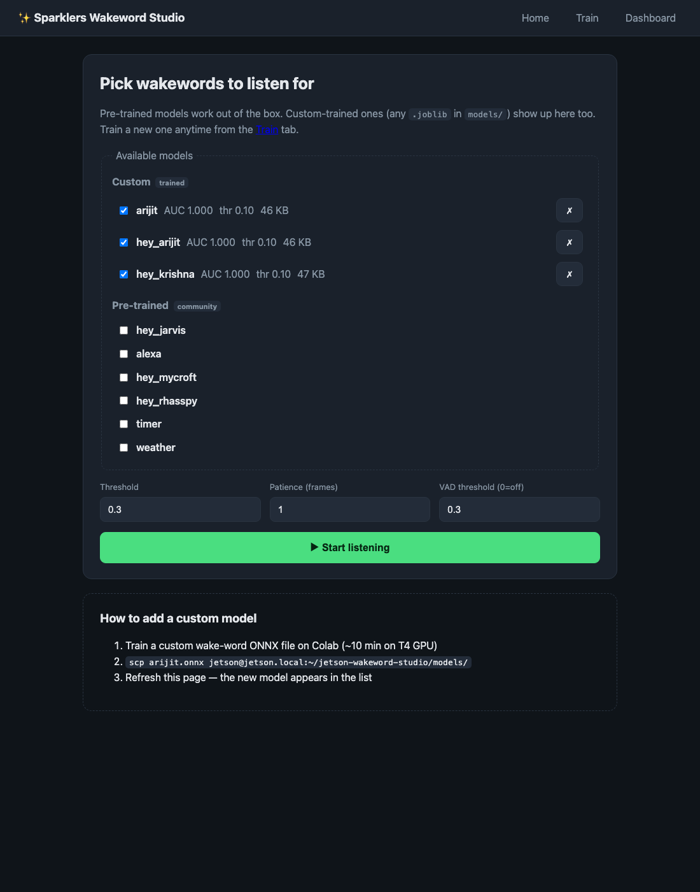
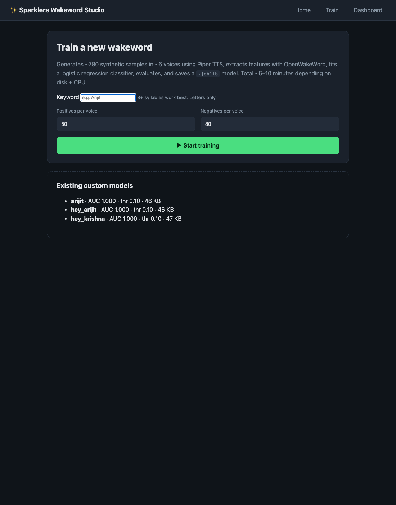
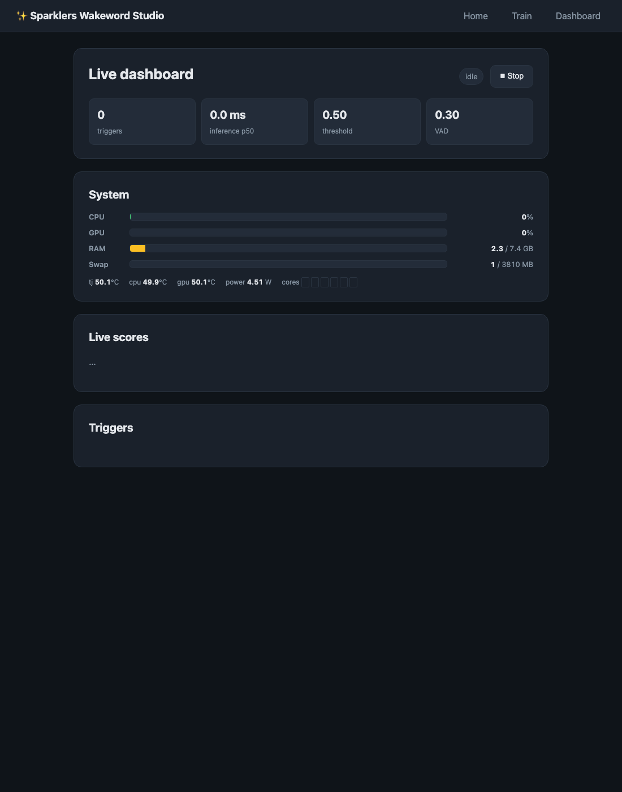

# Sparklers Wakeword Studio

**Self-hosted, speaker-independent custom wake-word detection on NVIDIA Jetson, with a full web UI.**

Type a keyword in the browser → ~3 minutes later (training), anyone saying that keyword fires a trigger event on the Jetson. No cloud, no API keys, no per-keyword fees. Runs offline forever.



Built on top of [OpenWakeWord](https://github.com/dscripka/openWakeWord)'s shared mel + speech embedding ONNX models, with a custom sklearn-based classifier trained on synthetic Piper-TTS data + reverb/noise augmentation + optional real-mic recordings of your voice. The whole training pipeline runs on the Jetson itself in ~3 min per keyword, with no GPU required.

---

## Features

- **One-click custom wake words** — type the phrase in the web UI, ~3 min later you have a trained model
- **Speaker-independent** — generates ~1300 synthetic training samples across 6 different Piper TTS voices + room/mic augmentation (reverb, noise mix, pitch jitter) so the model generalizes across speakers and rooms
- **Optional multi-person "record yourself" flow** — append a few clips at a time so you can swap speakers between batches (e.g. 3 samples per person × 3-4 people). User recordings are mixed into training with a 0.4× sample weight so they anchor the model on real-mic acoustics without dominating the decision boundary — keeps the model speaker-independent while improving recognition for hard-to-pronounce names where TTS gets it wrong
- **Fast training** — pre-baked keyword-independent negatives (built once at Docker build time) + per-voice parallel Piper synth + parallel ONNX feature extraction. ~3 min per keyword on Jetson Orin Nano Super, **10× faster than the original ~30 min pipeline**
- **Multi-word phrase handling** — for keywords like "Hey Krishna", automatically generates suffix-only ("krishna") and prefix-only ("hey", "hey there") hard negatives so partial phrases don't false-fire
- **Silence + noise robust** — training set includes 200 pure-silence and 200 noisy-distractor samples so ambient room audio stays well below threshold
- **Six OpenWakeWord pretrained models included** out of the box (`hey_jarvis`, `alexa`, `hey_mycroft`, `hey_rhasspy`, `timer`, `weather`)
- **Live web dashboard** — score bars per model, trigger feed with timestamps, system resource monitor (CPU/GPU/RAM/temps via tegrastats)
- **Headless beep-driven recording** — works without a display, uses audio cues for timing (high beep = say it now, low beep = sample captured)
- **~150 MB RAM**, **~17 ms inference per 80 ms audio chunk** on Orin Nano CPU (no GPU needed)
- **Custom models are 46 KB each** — drop more `.joblib` files into `models/` to add keywords

---

## Hardware

| Component | Tested with | Notes |
|---|---|---|
| Jetson | Orin Nano 8 GB (p3767-0005) | Should work on any Jetson with JetPack 6.x |
| JetPack | 6.2 (L4T R36.4.x) | |
| Audio | Waveshare USB Audio Codec (SSS1629/JMTek chip) | Any USB Audio Class 1.0 device should work. Built-in speaker for cue beeps recommended. |
| Storage | ≥ 5 GB free on `/` | image + Piper voices + training data |
| Network | for first pull only | After install, fully offline |

---

## Quick start

### Option A — Docker (recommended)

```bash
# On the Jetson:
curl -fsSL https://raw.githubusercontent.com/Arijit1080/sparklers-wakeword-studio/main/install.sh | bash
```

Opens at `http://<jetson-ip>:8082`.

### Option B — Manual Docker

```bash
docker run -d --name sparklers-ww \
  --restart unless-stopped \
  --device /dev/snd \
  -p 8082:8082 \
  -v sparklers_ww_data:/app/data \
  -v sparklers_ww_models:/app/models \
  ghcr.io/Arijit1080/sparklers-wakeword-studio:latest
```

### Option C — Bare metal (no Docker) — full step-by-step

If you'd rather not run a container, here's everything from a fresh JetPack 6.2 install. About 15 minutes of active work (most of it pip waiting).

#### 1. Plug in the USB audio codec and verify the mic

```bash
arecord -l
# Should list:
#   card 0: Device [USB PnP Audio Device], device 0: USB Audio [USB Audio]
```

If `card 0` isn't your USB device, find its number from `arecord -l` and use that as the device throughout. A quick capture test:

```bash
arecord -D plughw:0,0 -r 16000 -f S16_LE -c 1 -d 3 /tmp/test.wav && aplay /tmp/test.wav
```

If the recording is very quiet, the mic gain may be low. Boost it once and persist:

```bash
amixer -c 0 sset 'Mic' 100%        # capture gain to max (~31 dB)
amixer -c 0 sset 'Speaker' 100%    # playback (for the cue beeps)
sudo alsactl store 0               # persist across reboots
```

(Optional) Make the codec the default ALSA device so apps don't need explicit routing:

```bash
cat > ~/.asoundrc <<'EOF'
pcm.!default { type asym  capture.pcm "hw:0,0"  playback.pcm "plughw:0,0" }
ctl.!default { type hw  card 0 }
EOF
```

#### 2. Clone the repo

```bash
git clone https://github.com/Arijit1080/sparklers-wakeword-studio.git ~/sparklers-wakeword-studio
cd ~/sparklers-wakeword-studio
```

#### 3. Create a venv and pin numpy

We use `--system-site-packages` so the venv inherits JetPack's system numpy/scipy (and CUDA libs if we ever need them). **The numpy 1.x line is required** — many ML wheels for JetPack still link against numpy 1.x ABI, and mixing with numpy 2.x produces the dreaded "Expected 96 from C header, got 88" crashes.

```bash
python3 -m venv --system-site-packages venv
source venv/bin/activate
pip install --upgrade pip
pip install 'numpy<2'
```

#### 4. Install the Python stack

```bash
# Core data libs (pinned to versions known to work with numpy 1.x + py3.10)
pip install 'scipy>=1.11,<1.15' 'scikit-learn>=1.3,<1.6' 'pandas<2.2' joblib

# Audio I/O + ONNX runtime + OpenWakeWord
pip install sounddevice onnxruntime openwakeword piper-tts

# Web stack
pip install fastapi 'uvicorn[standard]' jinja2 python-multipart rich
```

If the venv complains that `pandas` is 2.x and incompatible, force-reinstall pandas in the venv to override the system one:

```bash
pip install --force-reinstall --no-deps 'pandas<2.2'
```

#### 5. Download OWW pretrained models + Piper voices

```bash
# OWW pretrained mel + embedding ONNX + 6 keyword classifiers (~10 MB)
python3 -c "import openwakeword; openwakeword.utils.download_models()"

# 6 Piper TTS voices used as training-data speakers (~377 MB, one-time)
python3 tools/download_voices.py
```

#### 6. Sanity-check the audio pipeline

```bash
python3 -c "
import sys; sys.path.insert(0, '.')
from audio.mic import find_usb_codec_index, list_input_devices
print('USB codec at input index:', find_usb_codec_index())
print('all inputs:', [d['name'] for d in list_input_devices()][:3])
"
```

Expected output: `USB codec at input index: 0`.

#### 7. Run the web UI

```bash
uvicorn web.app:app --host 0.0.0.0 --port 8082
```

Open `http://<jetson-ip>:8082` in any browser on the same network. Train a custom keyword, listen on the dashboard — same as the Docker flow.

#### 8. (Optional) Run as a systemd service

```bash
sudo tee /etc/systemd/system/sparklers-ww.service > /dev/null <<EOF
[Unit]
Description=Sparklers Wakeword Studio
After=network-online.target sound.target

[Service]
Type=simple
User=$USER
WorkingDirectory=$HOME/sparklers-wakeword-studio
ExecStart=$HOME/sparklers-wakeword-studio/venv/bin/uvicorn web.app:app --host 0.0.0.0 --port 8082
Restart=always
RestartSec=5

[Install]
WantedBy=multi-user.target
EOF

sudo systemctl daemon-reload
sudo systemctl enable --now sparklers-ww
journalctl -u sparklers-ww -f
```

Now it survives reboots and you can manage it like any other Linux service.

---

## Using the web UI


### 1. (Optional) Multi-person record yourself

Above the train form there's a **🎙 Record yourself** card. Type your keyword, pick **How many** (default 3), click **▶ Record samples**. On each high beep say the keyword once and stop — wait for the low beep, pause, then the next beep. The arpeggio at the end means the batch is done.

Each click **appends** to the existing set with the next available filename index. Sequence for multi-person coverage:

1. Click → person A records 3 → swap mic
2. Click → person B records 3 → swap
3. Click → person C records 3
4. (Optional) Click → record 1-3 more in noisier conditions / different distances
5. The counter shows the running total (`✓ N samples saved for "your keyword"`)

Why bother? For names TTS can't pronounce well (non-English names, brand names, slang), the synthetic positives don't match what the keyword actually sounds like. A handful of real recordings plant ground-truth anchors in the real-mic embedding region. Multiple speakers across batches teaches the model your room's acoustics without locking it to one voice.

**Influence is intentionally small.** Each user sample carries a 0.4× weight in training vs 1.0× for TTS, so 12 user samples = 4.8 effective positives against 300 TTS = ~1.6% of the positive signal. Enough to anchor real-mic acoustics; not enough to drag the boundary toward any one speaker. Skip the whole step if TTS already pronounces your keyword correctly.

### 2. Train a new keyword

Navigate to **Train** → type the phrase (e.g. `Hey Krishna`) → click Start.

You'll see a 4-phase progress bar:

1. **Downloading voices** — skipped if Piper voices are already cached (always skipped after first run; Piper voices ship in the Docker image)
2. **Generating samples** — runs in parallel across 6 CPU cores. Piper TTS synthesizes the keyword positives + multi-word hard negatives across 6 voices; keyword-independent distractor negatives are loaded from the pre-baked cache instead of re-synthesized. Augmentation pass adds reverb/noise/pitch-jitter copies of every TTS positive, plus pitch-shifted variants of any user recordings. ~100 s
3. **Extracting features** — fans WAV paths out to 5 worker processes, each running its own single-threaded OWW ONNX session. ~75 s
4. **Fitting classifier** — sklearn StandardScaler + LogisticRegression, <1 s
5. **Saving** — writes `models/<keyword>.joblib` (~46 KB)



Multi-word phrases like `Hey Krishna` automatically get **two extra hard-negative banks** (150 each):

- **Suffix-only** — "krishna", "hi krishna", "hello krishna", "yo krishna" → teaches "suffix alone doesn't fire"
- **Prefix-only** — "hey", "hey there", "hey you", "oh hey", "hey buddy" → teaches "prefix alone doesn't fire"

Without these, the classifier latches onto one half of the phrase as the trigger signal.

### 2. Listen on the dashboard



Home → pick model(s) → adjust threshold/patience/VAD → Start listening.

The dashboard shows:
- **Live score bar per model** with threshold marker
- **Trigger feed** with timestamp + score + which model fired
- **System resource panel** — CPU avg + per-core, GPU %, RAM, swap, temps, power
- Inference latency (`embed_ms_p50`)

---

## Best results — proven settings

These are the values that gave reliable triggering with minimal false positives in real testing on the Waveshare USB codec mic:

| Setting | Value | Why |
|---|---|---|
| **Threshold** | **0.3** | Single global threshold applied to every selected model. The trained classifier scores silence ~0 and non-keyword speech ~0.1, so 0.3 is a comfortable margin above noise and below true positives |
| **Patience** | **1** | Single above-threshold frame fires immediately. Higher values delay the trigger by 80 ms each — only useful if you're seeing brief 1-frame spikes from glitches |
| **VAD threshold** | **0.3** | Built into OpenWakeWord — skips scoring on silent windows. Has minimal effect when our energy-gate is also on (which it always is for sklearn models) |
| **Cooldown** | **2 s** | Suppresses repeat triggers from sustained utterances. Long enough to feel responsive, short enough not to miss the next intended trigger |
| **Mic gain** | **100% (~+31 dB)** on a USB codec | Set once via `amixer -c 0 sset 'Mic' 100% && sudo alsactl store 0`. Lower gain (50-70%) gives quiet live embeddings that fall outside the trained positive class region → scores never reach the firing threshold. 100% is loud but the classifier is robust to mild clipping at inference time |
| **Energy gate** (built-in, not user-tunable) | **-42 dBFS** over the 1.28 s window | Skips classifier entirely on silence, prevents false positives from ambient room noise |

If your keyword still misses: drop threshold to 0.25 manually before clicking Start, or retrain with `positives per voice = 100` (default 50) for more positive variation, or use the optional multi-person record-yourself flow.

If your keyword false-fires: raise threshold to 0.35-0.4 OR retrain — the prefix/suffix hard-negative pipeline assumes a 2-word keyword. For 3+ word keywords you may want to extend it.

---

## Architecture

```
   ┌─────────────────────────────────────────────────────────────┐
   │                          TRAINING                            │
   └─────────────────────────────────────────────────────────────┘
   At Docker BUILD time (once):
     Piper TTS (6 voices) synthesize 480 voice-distractor WAVs +
     200 clean noisy-distractor base WAVs → embed the voice
     distractors → ship as negatives_<hash>.npz in the image.

   At TRAIN time (~3 min/keyword):
     6 parallel Piper workers (one per voice) synthesize:
       ├─ 300 keyword positives (e.g. "Hey Krishna")
       ├─ 150 suffix-only hard negatives ("krishna", "hi krishna")
       └─ 150 prefix-only hard negatives ("hey", "hey there")
     Procedural (main thread):
       └─ 200 silence/low-noise negatives (-65 to -35 dBFS Gaussian)
     From pre-baked cache (no synth):
       ├─ 480 voice-distractor FEATURES (already embedded)
       └─ 200 noisy distractor base WAVs (mixed with per-run noise here)
     Augmentation pass on HARD-NEGATIVES only (not positives):
       └─ each suffix/prefix hardneg → one extra copy with random
          reverb + light noise + small pitch jitter, so "real-room-
          sounding speech" doesn't accidentally signal positive class
     IF user recordings exist (data/train/user_pos/<kw_safe>/*.wav):
       └─ each sample saved as-is, no pitch shifts, no aug copies.
          Down-weighted to 0.4x in the sklearn fit (via sample_weight)
          so ~10 user samples carry the influence of ~4 effective
          positives against the 300 TTS positives — anchors real-mic
          acoustics without dragging the boundary toward one speaker.
       ↓
   5 parallel embed workers, each running:
     OpenWakeWord shared backbone (pretrained, ONNX):
       ├─ melspectrogram_v0.1.onnx
       └─ embedding_model_v0.1.onnx
       ↓
   ~1300 × 1536-D feature vectors (16 frames × 96-D each)
       ↓
   sklearn:  StandardScaler  →  LogisticRegression
       ↓
   models/<keyword>.joblib  (~46 KB)

   ┌─────────────────────────────────────────────────────────────┐
   │                         INFERENCE                            │
   └─────────────────────────────────────────────────────────────┘
   USB codec mic  →  80 ms chunks @ 16 kHz
       ↓
   Energy VAD gate  (skip if 1.28 s window < -42 dBFS)
       ↓
   OWW AudioFeatures rolling mel + embedding buffer  ← ~14 ms / chunk
       ↓
   sklearn.predict_proba  ← <1 ms
       ↓
   threshold + patience (K-of-N) + cooldown
       ↓
   Trigger event + DONE beep
```

### Why this works

We're not training a deep model from scratch — the hard part (turning audio into a meaningful 96-D embedding) is already done by OWW's pretrained shared backbone (Google's speech embedding model under the hood). We just learn a linear decision boundary in that space: *"is this point closer to 'Hey Krishna' or to 'not Hey Krishna'?"*

That's why training is seconds, inference is 17 ms / chunk on a CPU, and the model file is 46 KB.

---

## Tech stack

| Layer | Component | Role |
|---|---|---|
| Hardware | Waveshare USB Audio Codec (SSS1629) | mic input + speaker output for cue beeps |
| Audio I/O | ALSA + `sounddevice` | 16 kHz mono PCM in/out |
| Feature extraction | OpenWakeWord `AudioFeatures` (their pretrained ONNX backbone) | mel-spectrogram + 96-D speech embedding |
| Classifier | sklearn `Pipeline(StandardScaler, LogisticRegression)` | binary keyword / not-keyword decision |
| TTS | [Piper](https://github.com/rhasspy/piper) (6 voices, 377 MB) | synthetic training audio |
| Inference runtime | `onnxruntime` (CPU) + sklearn `predict_proba` | <30 ms per chunk total |
| Web framework | FastAPI + Jinja2 + Server-Sent Events | dark-mode UI, live progress + score streams |
| System monitor | `tegrastats` subprocess | CPU / GPU / RAM / temps live on dashboard |

---

## Project layout

```
sparklers-wakeword-studio/
├─ audio/
│  ├─ mic.py             USB-codec capture + load_wav helpers
│  ├─ beep.py            sine-tone generators for cues (READY/DONE/RETRY)
│  ├─ vad.py             energy-based silence trim (offline)
│  └─ oww_features.py    wrapper around OWW's AudioFeatures (offline + streaming)
├─ apps/
│  ├─ recognize_loop.py    CLI inference with pretrained OWW models
│  └─ recognize_custom.py  CLI inference with our trained .joblib classifier
├─ tools/
│  ├─ download_voices.py        fetches the 6 Piper voices (~377 MB)
│  ├─ generate_samples.py       Piper TTS → WAVs (positives + distractors + silence + noisy + hard negatives)
│  ├─ audio_augment.py          pitch shift + small-room reverb + noise mix (pure numpy/scipy)
│  ├─ bake_negatives.py         Docker-build-time pre-bake of keyword-independent negatives
│  ├─ negatives_cache.py        runtime loader for the baked .npz cache (hash-validated)
│  ├─ parallel_synth.py         per-voice Piper workers + per-batch ONNX embed workers
│  └─ train_keyword_sklearn.py  extract features + fit sklearn pipeline
├─ web/
│  ├─ app.py             FastAPI routes
│  ├─ state.py           singleton state machine + background worker
│  ├─ sysmon.py          tegrastats parser
│  ├─ templates/         home.html, train.html, dashboard.html
│  └─ static/app.css     dark theme
├─ data/                 (volume) piper_voices/ + train/{positive,negative}/
├─ models/               (volume) trained .joblib files
├─ docker/
│  ├─ Dockerfile
│  ├─ entrypoint.sh
│  └─ docker-compose.yml
├─ install.sh            one-shot installer
└─ README.md
```

---

## Building the image yourself (Jetson)

```bash
git clone https://github.com/Arijit1080/sparklers-wakeword-studio.git
cd sparklers-wakeword-studio

# Build natively on the Jetson — uses CUDA 12.6 base, real arm64 wheels
docker build -t ghcr.io/Arijit1080/sparklers-wakeword-studio:latest \
             -t ghcr.io/Arijit1080/sparklers-wakeword-studio:sha-$(git rev-parse --short HEAD) \
             -f docker/Dockerfile .

# Test locally
docker run --rm -p 8082:8082 --device /dev/snd \
  ghcr.io/Arijit1080/sparklers-wakeword-studio:latest

# Push to your registry
echo $GITHUB_TOKEN | docker login ghcr.io -u Arijit1080 --password-stdin
docker push ghcr.io/Arijit1080/sparklers-wakeword-studio:latest
docker push ghcr.io/Arijit1080/sparklers-wakeword-studio:sha-$(git rev-parse --short HEAD)
```

The image is roughly 1.5 GB compressed (most of which is the JetPack base + Piper voices). First build is ~25-30 min on Orin Nano. Subsequent builds reuse the slow layers in ~3-5 min.

---

## Limits / known caveats

- **Augmentation is synthetic** — reverb is a hand-rolled small-room IR, noise is Gaussian white. They close most of the TTS→real-mic gap (especially when combined with the "record yourself" flow), but they're not the same as a real impulse response from your kitchen. If you can spare 30 s for the optional recording step, do it.
- **No noise dataset** — silence-with-Gaussian-noise is a stand-in for real ambient (TV, traffic, fan). Adding the open FSD50K negatives would improve robustness in genuinely noisy rooms.
- **Single-threaded mic** — only one listening session, one training run, or one recording session at a time. They all share the mic.
- **CPU-only inference** — no GPU acceleration today. Orin Nano CPU has plenty of headroom (~17 ms / 80 ms chunk) so this hasn't bottlenecked anything yet.
- **Bake cache is voice-list-bound** — adding or removing a Piper voice invalidates the pre-baked `.npz` (hash changes). The runtime loader detects this and falls back to live synth, but you'll lose the ~3 min speedup until the image is rebuilt.

---

## License

MIT. See LICENSE.

Built on:
- [OpenWakeWord](https://github.com/dscripka/openWakeWord) (Apache 2.0)
- [Piper TTS](https://github.com/rhasspy/piper) (MIT)
- [scikit-learn](https://scikit-learn.org/) (BSD)
- [FastAPI](https://fastapi.tiangolo.com/) (MIT)
